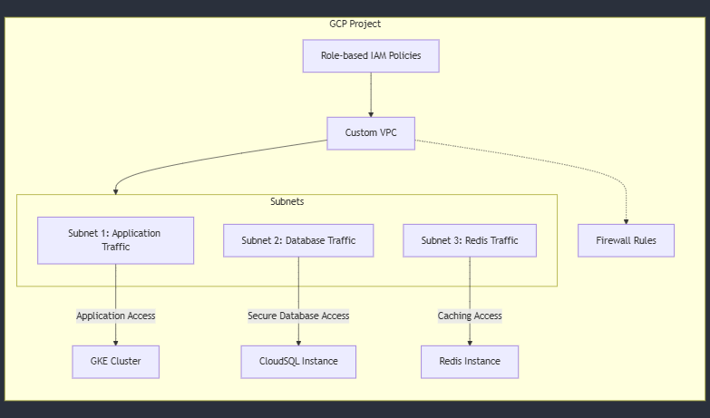

---

# (Task 04) GCP Concepts & Networking

### 

## Overview

This project involves setting up a secure and isolated environment on Google Cloud Platform (GCP) for a new application using CloudSQL, GKE (Google Kubernetes Engine), and Redis, all within a custom VPC. The architecture is designed to enhance security, optimize costs, and ensure high availability.

## High-Level Architecture

### Networking Setup:
The environment uses a **custom Virtual Private Cloud (VPC)** with dedicated subnets for different components to ensure network isolation. The components involved are:

- **Google Kubernetes Engine (GKE)**: The application workloads run on GKE within a dedicated subnet.
- **CloudSQL**: Managed relational database service in its own isolated subnet.
- **Redis**: Caching layer also deployed in its own subnet.
  
The network design includes:

- **Private IPs**: All resources (GKE, CloudSQL, Redis) leverage private IPs to avoid exposure to the public internet.
- **Firewall Rules**: Custom firewall rules are configured to allow only the necessary traffic between the components. For instance, GKE has restricted access to CloudSQL and Redis, and only specific sources can access the resources.
- **VPC Peering**: Used for connecting the components, ensuring internal traffic stays isolated within the VPC.
- **VPC Flow Logs**: Enabled to capture and analyze network traffic within the VPC.

## Security

### Key Security Measures:
- **IAM Policies**: Role-based Identity and Access Management (IAM) policies are implemented to enforce **least-privilege access**, ensuring users and services only have the permissions they need.
- **Encryption**:
  - **Data at Rest**: All data stored in CloudSQL, Redis, and GKE is encrypted using **Google-managed encryption keys**.
  - **Encryption in Transit**: **TLS** (Transport Layer Security) is enforced to ensure that all data transmitted over the network is secure.
- **API Access Control**: The GKE API access is restricted to only authorized networks, ensuring that only trusted systems can interact with the GKE cluster.
- **Cloud Monitoring and Alerts**: 
  - **Stackdriver** is utilized for monitoring the infrastructure and setting up alerts to proactively detect and respond to any anomalies.
  - **VPC Flow Logs** are used to monitor and analyze network traffic, providing visibility into any unauthorized access or issues.

## Cost Optimization and High Availability

### Strategies for Cost Optimization and High Availability:
- **Preemptible VMs**: Preemptible VMs are used for non-critical GKE workloads, offering significant cost savings while ensuring that critical workloads are unaffected by VM termination.
- **Auto-scaling**: GKE and CloudSQL are configured with autoscaling to dynamically adjust resource usage based on demand, ensuring efficient resource allocation and cost savings.
- **Multi-Zonal Deployments**: To enhance fault tolerance and ensure high availability, both CloudSQL and GKE are deployed across multiple zones. This configuration ensures that if one zone experiences an issue, resources in other zones can take over.
- **Redis High-Availability Replication**: Redis is configured with high-availability replication to prevent downtime in case of node failures.
- **Committed-Use Discounts**: Google Cloud's **committed-use contracts** are used to reduce costs for CloudSQL and Redis, offering significant discounts in exchange for long-term usage commitments.
- **Automated Backups**: Regular automated backups are configured for both CloudSQL and Redis to safeguard against data loss and ensure business continuity.
- **Budget Alerts**: Cloud Monitoring is used to set up budget alerts, helping to track costs and prevent budget overruns while maintaining efficiency.

## Summary

This setup ensures a **secure** environment by leveraging **private networking**, **IAM policies**, and **encryption**. Cost optimization is achieved through **preemptible VMs**, **autoscaling**, and **committed-use discounts**, while **high availability** is ensured using **multi-zonal deployments** and **Redis replication**.

---

**Evaluation Criteria**:

- Demonstrated understanding of **GCP services** and **networking** principles.
- Critical thinking in the areas of **security** and **cost optimization**.

---
# (TASK 05) Problem-Solving & Troubleshooting Approach
### Problem-Solving & Troubleshooting Approach for Network Timeout Between GKE Pods and CloudSQL

#### **Problem Context:**
A critical service running on Google Kubernetes Engine (GKE) has failed, resulting in downtime. Logs indicate a network timeout between the application pods and CloudSQL. The goal is to troubleshoot and resolve the issue, then implement steps to prevent future occurrences.

---

### **1. Troubleshooting Approach:**

#### **Step 1: Analyze Logs**
- **Application Logs:** Retrieve logs from the affected GKE pods using `kubectl logs`. Check for database connection timeouts, authentication errors, or other relevant issues.
- **CloudSQL Logs:** Review CloudSQL logs in the GCP Console for rejected connections or network-related issues such as timeouts or failures.
- **VPC Flow Logs:** Examine VPC Flow Logs to trace the flow of traffic between the GKE pods and the CloudSQL instance. Focus on dropped packets, denied requests, and misrouted traffic.

#### **Step 2: Verify Networking Configuration**
- **Firewall Rules:** Ensure that firewall rules allow traffic from the GKE subnet to the CloudSQL private IP on the appropriate port (e.g., 3306 for MySQL, 5432 for PostgreSQL).
- **Private IP Configuration:** Confirm that CloudSQL is configured with a private IP, making it accessible from the GKE subnet. If they are in different VPCs, ensure that VPC peering or private service access is configured correctly.
- **DNS Resolution:** Deploy a debug pod in the GKE cluster to confirm that DNS resolution of the CloudSQL hostname points to the correct private IP. Use `nslookup` to check DNS resolution.

#### **Step 3: Validate Application Configuration**
- **Database Connection String:** Ensure the application is using the correct CloudSQL private IP or connection string in the connection settings.
- **Service Account Permissions:** Verify that the service account associated with the application has the necessary IAM role (`Cloud SQL Client`) to authorize connections to CloudSQL.

#### **Step 4: Test Connectivity**
- **Debug Pod:** Deploy a debug pod in the GKE cluster and test connectivity using tools like `mysql-client` or `psql`. This will help isolate whether the issue lies with the networking or firewall configurations. If the connectivity test fails, it indicates a misconfiguration.
  
#### **Step 5: Check Resource Health**
- **GKE Pods and Nodes:** Use `kubectl describe` to check the status of pods and nodes in the GKE cluster, ensuring that there are no resource failures.
- **CloudSQL Status:** Check the operational status of CloudSQL in the GCP Console to confirm there are no ongoing issues such as resource exhaustion or instance downtime.

---

### **2. Resolving the Network Timeout and Preventing Future Issues:**

#### **Step 1: Analyze Logs and Metrics**
- **Cloud Logging and Monitoring:** Use Cloud Logging and Monitoring (formerly Stackdriver) to gather logs from both GKE and CloudSQL. Logs will help identify connection issues, while metrics can show anomalies like high latency or packet drops.
- **VPC Flow Logs:** Examine VPC Flow Logs for any blocked or misrouted traffic between GKE and CloudSQL.
  
#### **Step 2: Verify Networking Configuration**
- **Firewall Rules:** Ensure that the firewall rules allow traffic from the GKE subnet to the CloudSQL private IP on the required port. This is a crucial step to ensure that the GKE pods can communicate with CloudSQL.
- **Private IP Setup:** Double-check that CloudSQL is using a private IP, and verify that both GKE and CloudSQL are in the same VPC or properly connected via VPC peering.
- **DNS Resolution Test:** Deploy a debug pod and verify DNS resolution with `nslookup` to ensure that the application resolves the CloudSQL hostname to the correct IP.

#### **Step 3: Validate Application Configuration**
- **Connection String:** Ensure the application uses the correct connection string or CloudSQL private IP. Check that the environment variables for the database host, port, username, and password are accurate.
- **IAM Role:** Confirm that the service account running the application has the `Cloud SQL Client` IAM role, allowing it to access CloudSQL.

#### **Step 4: Test Connectivity**
- **Direct Connectivity Test:** Use a debug pod and test direct connectivity to CloudSQL using tools like `mysql-client` or `psql`. This will help isolate whether the issue is with the networking or firewall configurations.

#### **Step 5: Check Resource Health**
- **GKE Cluster Health:** Use `kubectl describe` to inspect the status of GKE pods and nodes. Ensure there are no issues with resource allocation or pod restarts.
- **CloudSQL Health:** In the GCP Console, verify that CloudSQL is operating correctly and check for issues like resource exhaustion, high load, or downtime.

---

### **Steps to Prevent Future Network Timeout Issues:**

#### **1. Implement Monitoring and Alerts**
- **Cloud Monitoring:** Set up Cloud Monitoring to detect issues such as high latency, packet drops, or connection failures. Create alerts to notify the team of potential problems before they escalate.

#### **2. Automate Configuration Management**
- **Terraform:** Use Terraform to automate the provisioning of firewall rules, IAM policies, and resource configurations. This helps avoid manual misconfigurations and ensures consistent infrastructure.

#### **3. Use Readiness and Liveness Probes in GKE**
- **Application Health Checks:** Add readiness and liveness probes to the GKE deployment. For example, a readiness probe can check the database connection, ensuring that the application only serves traffic when the database connection is healthy.

#### **4. Optimize Resource Usage**
- **CloudSQL Scaling:** Monitor CloudSQL capacity and scale it as needed to handle peak loads. Use connection pooling to optimize database connections and minimize resource consumption.
  
#### **5. Backup and Recovery**
- **CloudSQL Backups:** Schedule regular backups of CloudSQL to prevent data loss.
- **Recovery Plan:** Implement a recovery plan to handle unexpected failures quickly and restore services with minimal downtime.

---

### **Summary:**
The troubleshooting approach involves a comprehensive analysis of logs, networking configurations, application setup, and connectivity tests. After resolving the network timeout, preventive steps include implementing monitoring, automating infrastructure, and optimizing resources. This proactive approach helps ensure that similar issues are prevented in the future, leading to a more resilient system architecture.

